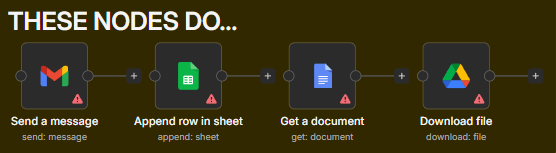
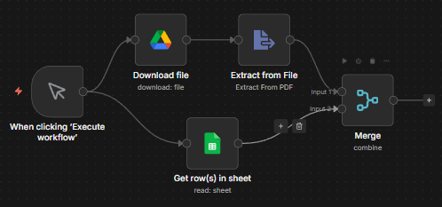

# **n8n Basics**

!!! info
    n8n is a workflow automation tool that lets you connect apps and services without code. Workflows are made of **nodes** representing actions, triggers, or operations.

---

## **Types of Nodes**

Nodes are the building blocks of workflows. Main types include:

### **Trigger Nodes**


- Start a workflow automatically.  
- Examples: Webhook (on HTTP request), Cron (scheduled intervals), Gmail (new email).

### **Action / Regular Nodes**



- Perform tasks or operations after a trigger.  
- Examples: Send Email, Upload a file, Google Sheets Append.

!!! warning
    See the warning signs at the bottom right of the nodes? It means that those nodes are either not set up correctly or has some problems or bugs in them. We better fix them before executing a workflow or else the entire workflow will fail. **Never ```Publish``` a workflow that has bugs.**

### **Function / Logic Nodes**


- Manipulate or transform data within the workflow.  
- Examples: Function (custom JS), Set (define data fields), Merge (combine datasets).

### **App / Integration Nodes**
- Prebuilt connectors for apps like Airtable, Salesforce, Notion, etc.

---

## **Node Connection Rules**



- Workflows start from a **trigger node**.  
- Nodes are connected **from output to input**.  
- A node can have multiple outputs (branches), and nodes can merge multiple inputs.  
- Nodes execute in the order of the workflow graph.  

**Key point:** Trigger → Action → Action/Function → Output (optional).

---

## **Adding Credentials**
Many nodes require authentication to access APIs or services. Steps:

1. Open the node that needs credentials.  
2. Click **“Credentials”**.  
3. Choose **existing credentials** or **create new**.  
4. Enter required details (API key, OAuth token, username/password, etc.).  
5. Save and test the connection. 


> n8n securely stores credentials and reuses them across nodes.

---

## **Basic WorkFLOW**
1. Choose a **trigger** (Webhook, Cron, etc.)  
2. Connect one or more **action nodes**  
3. Optionally use **logic/function nodes** for data processing  
4. Test workflow with **“Execute Node”** or **“Execute Workflow”**  
5. Activate workflow for automation

---

## **Tips**
- Keep workflows modular; split complex logic into smaller nodes.  
- Use **Set** or **Function** nodes to simplify data before sending to apps.  
- Test nodes individually before activating the full workflow.