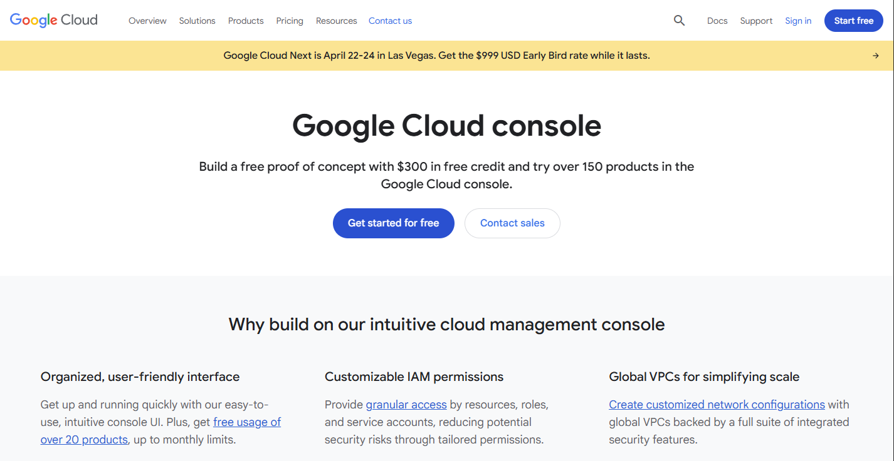
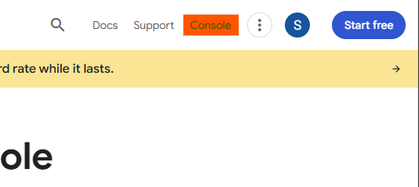
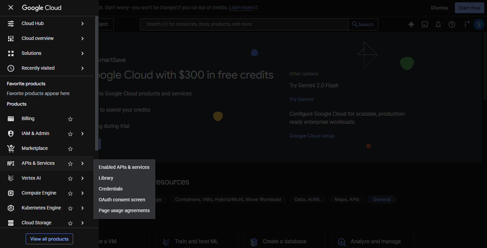
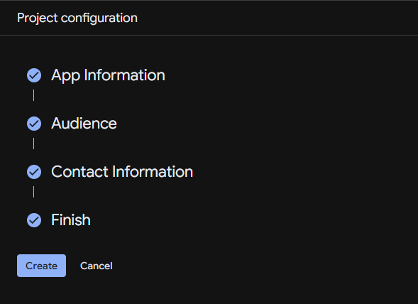
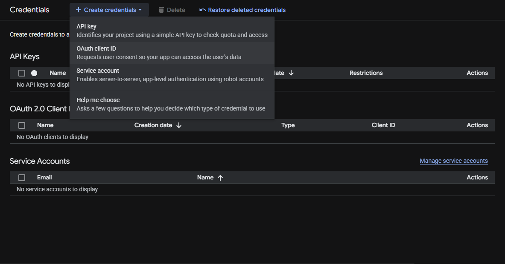
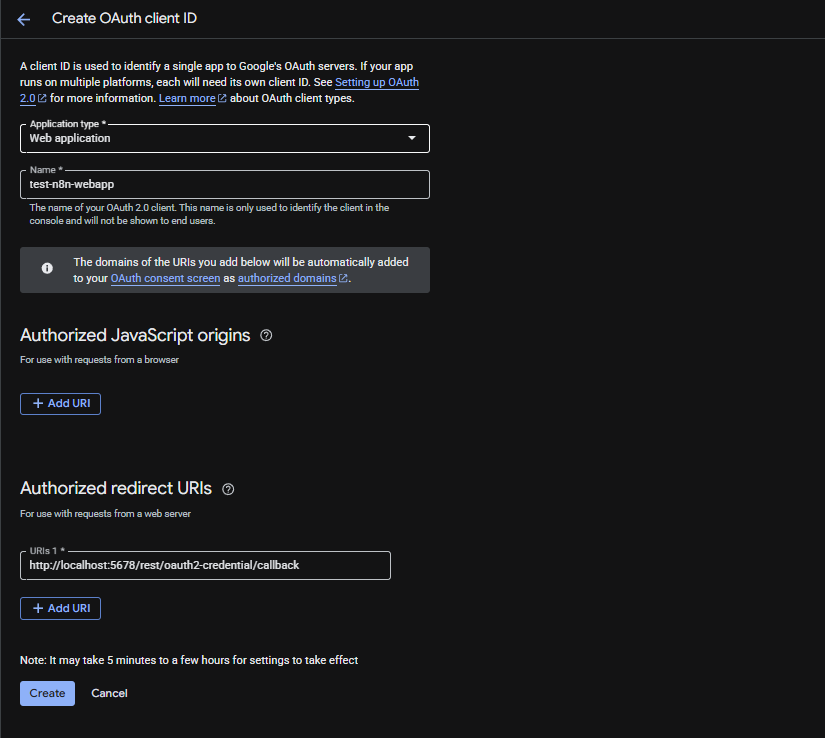
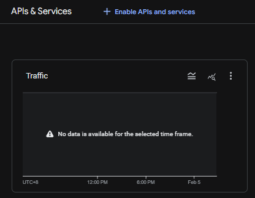
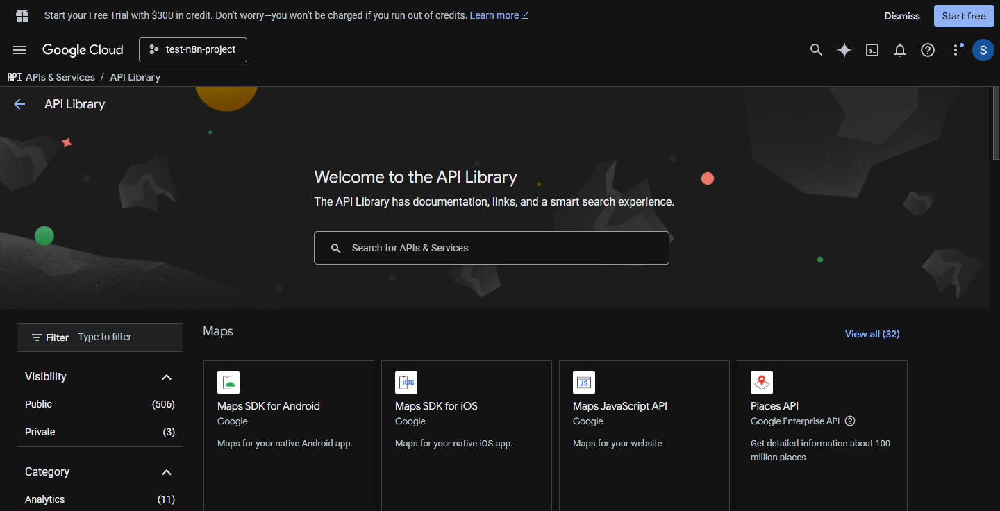
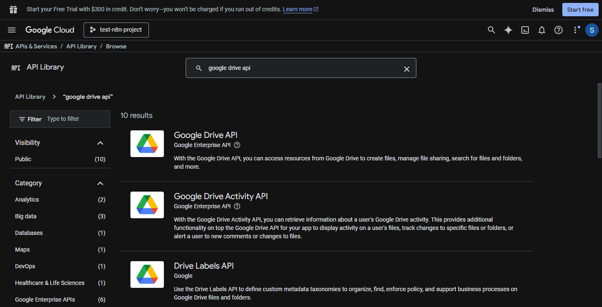
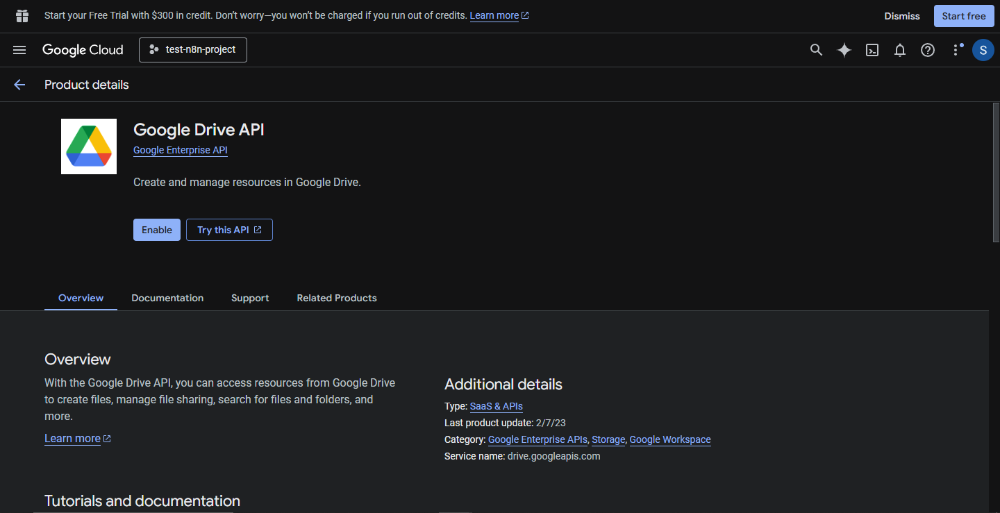

# **Credentials**

This section will guide you in creating credentials needed for third party services to work on your n8n instance.

As a starter, we will make the following credentials:

- Google **```ClientId```** and **```ClientSecret```**
- AI Model API Keys (OpenAI and Cohere)

## **Google Console**

In order to use Google APIs and Services, we need a ClientId and Client secret that would act as our credentials for google. 

To create those, let's head on to [cloud.google.com/cloud-console](https://cloud.google.com/cloud-console?utm_source=google&utm_medium=cpc&utm_campaign=Cloud-SS-DR-GCP-1713664-GCP-DR-APAC-PH-en-Google-BKWS-MIX-GenericCloud&utm_content=c-Hybrid+%7C+BKWS+-+BRO+%7C+Txt+-+Generic+Cloud-Console-Cloud+Console-PH_en-300347532853&utm_term=google%20console&gclsrc=aw.ds&gad_source=1&gad_campaignid=12297519333&gclid=EAIaIQobChMItoCi463AkgMV-2wPAh2uRC5rEAAYASAAEgKQOPD_BwE) then Sign In.



Once you have signed in, click the **```Console```** option found at the top right of the screen. (highlighted in orange below)



This will then redirect you to your google console. On the modal that will appear, tick the checkbox then **```Agree and Continue```**


Once done, click **```Select a project```** then **```New project```**.

After that, the next screen to pop up Will be the New project form. Here we will be asked to name our project and select our organization. 

You may continue and fill up these fields with your own intended inputs or do so as I did here.

    Project Name    : test-n8n-project
    Location        : No organization


After setting that up, click create and then the page will direct us back to the page earlier. 

Here, we will receive a notification once our project has been created. That notification will contain a button saying **```Select Project```** click that to proceed.

In any case the project was not selected after clicking the button, just click **```Select a project```** again and then click the name of the project you created.


---

## **OAuth Consent Screen**

After creating the project, click the navigation menu (sidebar) button and expand API & Services then click **```OAuth Consent Screen```**.



At the sidebar of that screen, click **```Branding```** then click **```Get Started```**


We will then fill up the Project Configuration Form.

    App name            : test-n8n-branding (feel free to give it a unique name)
    User support email  : (select your email)
    Audience            : External (users with no Google workspace cannot select internal)
    Email Addresses     : (select your email or another email intended to receive project notifications)





---

## **Creating OAuth 2.0 Client IDs**

Once we have created our OAuth consent screen, let's click the navigation menu again, expand API & Services then this time, click **```Credentials```**.


At this screen, click on **```Create Credentials```** and select **```OAuth client ID```**



Answer the form like the following example

    Application Type: Web Application   
    Name            : test-n8n-webapp
    Authorized URI  : http://localhost:5678/rest/oauth2-credential/callback



Click **```Create```** to proceed.

!!! note
    You can get the Authorized URI in n8n by getting into the credential creation form. Along with the fields are the callback or the OAuth Redirect URL link to be used in the Authorized URI field.

    

    The link we used is intended and may be the same if you are self-hosting your n8n instance locally on your machine.

    If you are operating n8n on a deployed service or domain, the callback link may change.

After this a modal will pop up containing the credentials we need, the ClientID and Client Secret.

!!! warning
    **I HIGHLY RECOMMEND SAVING THESE CREDENTIALS TO AVOID LOSING THEM**

    Please note that while you may be able to revisit this page and view your Client ID, your Client Secret is only visible at this point.

    In any case you **forgot or have lost** your Client Secret, you may need to create a new one.


Click **```Save```** once done.

---

## **Enabling ```APIs & Services```**

Once you have your OAuth screen setup and credentials ready, We can then proceed to enabling Google APIs for them to work on your n8n instance.

To proceed, open up the navigation menu again then click **```Enabled APIs & Services```**


Here we will click the Enable APIs & Services button located at the top right corner of the panel(not the screen, the panel).



After being redirected to the API Library Page, you may then search for the services you wish to work along with the credentials we created.





Once you have found the API you wish to enable, click it and then click the **```Enable```** button.



---

## AI Model API Keys

Creating AI model API keys are quite easy. We just need to access their website and create our keys. 

This process may require you to create an account with the model provider to record usage and view limits.

To start we may simply search "[AI Provide] api keys" on our browser. An example of this is "OpenAI api keys" or "Cohere api keys".

You may also visit these links for easy access:

- [OpenAI](https://platform.openai.com/settings/organization/api-keys)
- [Cohere](https://dashboard.cohere.com/welcome/login)
- [OpenRouter](https://openrouter.ai/docs/api/api-reference/api-keys/create-keys)
- [Gemini](https://aistudio.google.com/welcome?utm_source=google&utm_medium=cpc&utm_campaign=Cloud-SS-DR-AIS-FY26-global-gsem-1713578&utm_content=text-ad&utm_term=KW_gemini%20api%20key&gad_source=1&gad_campaignid=23417416052&gbraid=0AAAAACn9t64JfjcQ77ypxy769UtTZ596_&gclid=Cj0KCQiA-YvMBhDtARIsAHZuUzL_LS67zOZRR7UE2dL2u-8O7bqfup5X3Oncy_W91WJY3u9yedxClxQaAsCaEALw_wcB)

!!! note
    While OpenAI and Gemini are one of the most famous providers of models, I suggest making use of Cohere models during testing to save costs.

    In my experience, they have the most generous limits and rates out of all companies so far.

    You may then switch to your ideal AI Model provider in production for better outputs.

---

**That's it! You're done!!!**

You may now use your credentials in n8n.

---

## **Adding Credentials on n8n**

Many nodes require authentication to access APIs or services. Steps:

1. Open the node that needs credentials.  
2. Click **“Credentials”**.  
3. Choose **existing credentials** or **create new**.  
4. Enter required details (API key, OAuth token, username/password, etc.).  
5. Save and test the connection. 


> n8n securely stores credentials and reuses them across nodes and even throughout your entire n8n instance.

---