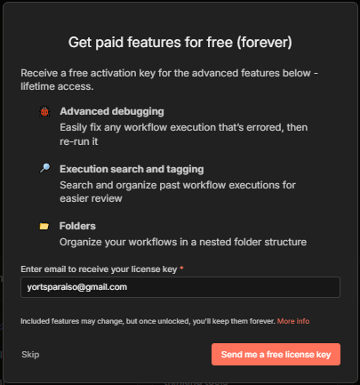
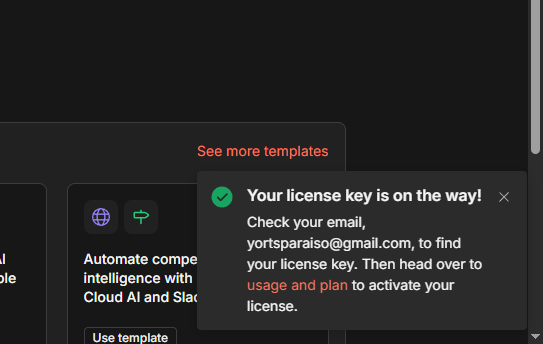

# **Local n8n installation using Node.js (npm)**

This section will guide you in installing n8n through Node.js or via the use of npm commands for self-hosting.
Please note that the information provided here is based on the documentation found on n8n's website. You may access this resource by clicking **[here](https://docs.n8n.io/hosting/installation/npm/#try-n8n-with-npx)**.

***

## Install n8n globally
1. Open up a Terminal or a Command Line Interface (Might appear as CMD or Command prompt on your computer)

2. We first install n8n globally using. This might take a while.
    ```bash
    npm install n8n -g
    ```

3. Once the installation has completed, we then run.
    ```bash
    n8n start
    ```
    Once you see these messages it means that n8n is up and running locally on your own machine.
    ```bash
    Editor is now accessible via:
    http://localhost:5678

    Press "o" to open in Browser.
    ```
4. We may then either press o inside the terminal or open a browser and access 
    ```bash
    localhost:5678
    ```

5. Once we're inside, we should then answer these forms. You may do it however you want or respond as I did in the examples below

    
    

6. When this screen appears, enter a valid email address on the field below and click send me a free license key. This gives your locally self-hosted n8n instance a lifetime access to all of their great features.

    <center>
    
    </center>

7. After that this little notification will appear at the bottom right of your screen. Click the highlighted ```usage and plan```

    <center>
    
    </center>

8. That will then bring you to this screen. Click the **```Enter Activation Key```** button and enter the activation key on the field that will appear.
!!! note
    Your activation key will be sent to the email that you have provided earlier. Just copy that key and paste it here.

**That's it! You have successfully self-hosted n8n.**