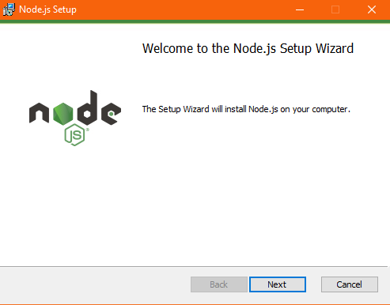
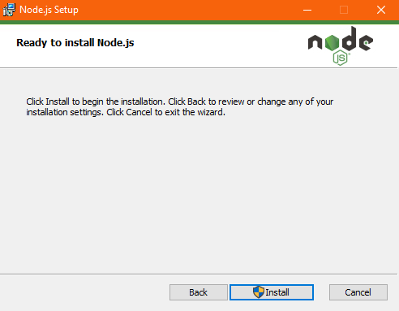
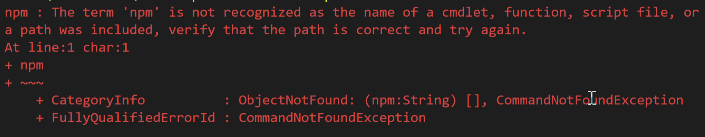
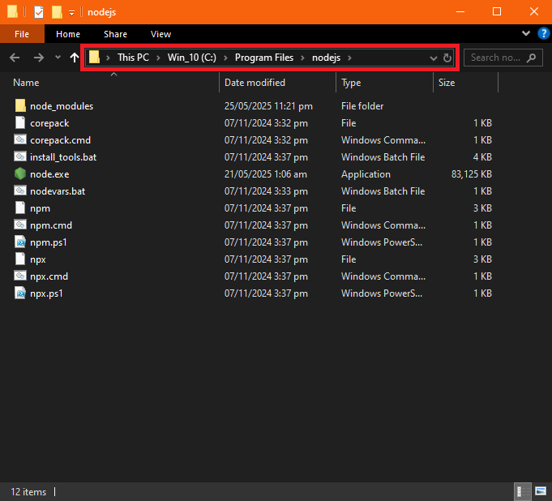
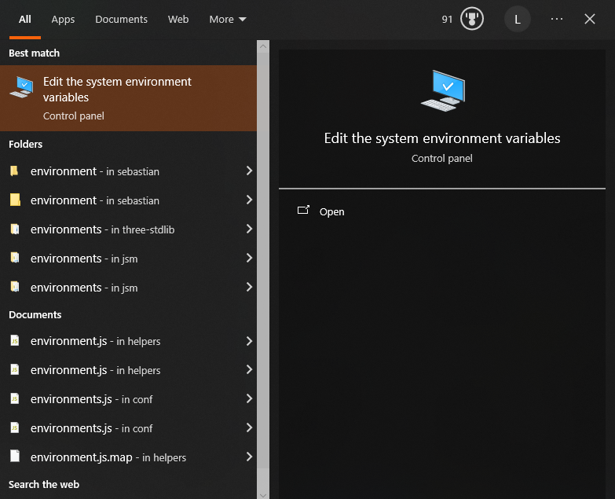
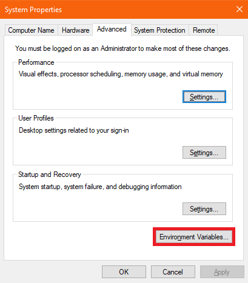
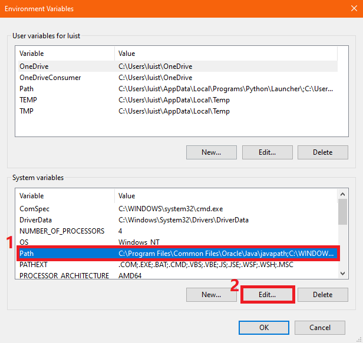

# **Prerequisites**
This section highlights the requirements we need to install n8n locally on your machine.
Within this page is a checklist of what we need to install n8n using Node.js

!!! Warning 
    This tutorial assumes that your computer runs on Windows OS. Steps may vary for other Operating Systems.

***

## **Summary of what we need:**
- Node.js (Yup! That's all we need!)

***

## **Node.js Installation**
- Can be downloaded by going into this page **[https://nodejs.org/en/download](https://nodejs.org/en/download)**
    
- After downloading:
    - **Run** the installer
    - Click **Next**

        ??? info
            <center>
            
            </center>

    - **Accept** the agreement
            
        ??? info
            <center>
            
            </center>

    - Keep installation folder as **default**

        ??? info
            <center>
            
            </center>
    
    - You may skip these screens by clicking **next**

        ??? info
            <center>
            
            </center>
            <center>
            
            </center>

    - complete the installation by clicking **install**

        ??? info
            <center>
            
            </center>

    - After installation, open up a command prompt and run the commands below to verify that both node and npm works
    
        ```bash 
        node --version

        # if this fails, don't worry. We'll fix it using the steps below. 
        npm --version
        ```

***

## **Troubleshooting**
### Missing environment variables



Oh no! You encountered the error above, what do we do now!?

Don't worry about that. That error only meant that npm was not yet added to your computer's environment variables.


!!! Info
    Just to explain this bit to the curious, n8n will run using Node's environment, that's why we installed Node.js. 

    But to install n8n, we need to have npm or Node's package installation manager. It's like Node's App Store without it being a store.

**Let's get into fixing!**

- Press the windows key and search for **```npm```**
- Find the one that's labeled as **```run command```** then either right click it or on the tab beside it, click Open file location.

    

- After that, a file manager will open where npm is located. Click the directory above and copy the directory. It should be something like ```C:\Program Files\nodejs```.

    

- Once we copy the directory, we will press the windows key again and search for environment variables. Once it appears, click it.

    

- Then proceed to follow the images below:

    
    
    

- Close all the windows then restart your computer.

- Once restarted, open CMD again and run

    ```bash
    npm --version
    ```

    If it returns a version, it means it worked.
***
